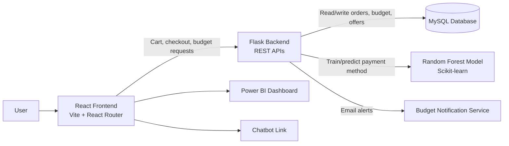

# HackOn with Amazon

A full-stack e-commerce and budgeting solution built for the Amazon HackOn challenge. The project combines a shopping experience with smart payment-method recommendations, budget tracking, and analytics to help users spend more consciously and complete purchases with better financial decisions.

## Problem Statement

Online shoppers often face three common problems during checkout:

- They choose a payment method without considering offer availability, success rate, or personal spending patterns.
- They may overspend beyond a planned budget without clear alerts or tracking.
- They do not get a unified view of purchase behavior, payment recommendation, and spending limits in one workflow.

This creates confusion, poor buying decisions, and avoidable financial stress.

## What This Project Solves

This app solves that by combining:

- an Amazon-like shopping storefront,
- a budget planner and expense tracker,
- a recommendation engine that suggests the most suitable payment method,
- a dashboard for spending visibility,
- and budget notifications to prevent overspending.

It gives users a smooth, purchase-focused experience while supporting smarter spending decisions and better financial control.

## Architecture Overview



## System Design

### Frontend
The frontend is a React application built with Vite and React Router. It includes:

- product catalog and shopping cart,
- payment page with selectable payment methods,
- budget form and spending overview,
- analytics dashboard embedded via Power BI,
- navigation for cart, dashboard, and budget features.

### Backend
The backend is a Flask service that exposes APIs for:

- receiving cart totals,
- predicting the recommended payment method,
- setting and retrieving budget limits,
- updating spend records at checkout,
- sending budget-related email notifications.

### Data Layer
The application currently relies on a MySQL database for:

- transactions,
- offers,
- budgets,
- orders.

These records are used to build historical payment data and generate recommendations based on real spending patterns.

### ML Recommendation Engine
The backend loads historical transaction and offer data, creates a feature set using:

- transaction amount,
- net benefit from cashback and charges,
- payment success rate,
- frequently used payment method,
- and date-based offer matching.

Then it trains a Random Forest classifier to recommend a payment method based on purchase context.

## Key Features

- Amazon-style product listing with add-to-cart functionality
- Cart subtotal calculation before checkout
- Payment method recommendation based on historical success patterns and offers
- Budget setup with validity date
- Remaining budget visualization via pie chart
- Budget notification warnings when usage thresholds are crossed
- Power BI embedded dashboard for business insight
- Orders persisted in a database after checkout

## Project Structure

```text
HackOn-with-Amazon-main/
├── backend/
│   └── server.py
├── frontend/
│   ├── public/
│   ├── src/
│   ├── package.json
│   ├── vite.config.js
│   ├── tailwind.config.js
│   └── README.md
├── README.md
└── .gitignore
```

## Key Files

- [backend/server.py](backend/server.py) — main Flask application with ML logic, APIs, and checkout integration
- [frontend/src/App.jsx](frontend/src/App.jsx) — route-level app setup
- [frontend/src/pages/shop/shop.jsx](frontend/src/pages/shop/shop.jsx) — storefront page
- [frontend/src/pages/cart/cart.jsx](frontend/src/pages/cart/cart.jsx) — cart and checkout flow
- [frontend/src/components/Payment.jsx](frontend/src/components/Payment.jsx) — payment selection and recommendation UI
- [frontend/src/pages/Budget/budget.jsx](frontend/src/pages/Budget/budget.jsx) — budget planning screen
- [frontend/src/pages/dashboard/dashboard.jsx](frontend/src/pages/dashboard/dashboard.jsx) — embedded Power BI analytics

## Tech Stack

- Frontend: React, Vite, React Router, CSS
- Styling: Tailwind CSS, custom CSS modules
- Backend: Python, Flask
- ML: scikit-learn, pandas, NumPy
- Database: MySQL
- Visualization: Power BI
- Email alerts: Python smtplib and EmailMessage

## Setup Instructions

### 1. Frontend
```bash
cd frontend
npm install
npm run dev
```

### 2. Backend
```bash
cd backend
pip install flask flask-cors pandas numpy scikit-learn mysql-connector-python
python server.py
```

### 3. Database
Create a MySQL database named `hackonamazon` and ensure the required tables exist for:

- `transaction`
- `offers`
- `budget`
- `orders`

The backend currently connects with MySQL using local credentials and assumes a local MySQL instance is available.

## Why This Matters

The project addresses a very real user problem: people make purchase decisions quickly, but they often lack a recommended path that balances savings, convenience, and spending limits. This app turns checkout from a generic flow into a more intelligent, financially aware experience.

## Conclusion

HackOn with Amazon is not just a shopping app; it is a decision-support platform for e-commerce. It brings together commerce, analytics, budgeting, and machine learning to help users buy better, spend wiser, and stay in control of their finances.
